# Mini-CMS

Projet fil rouge de l'Atelier Framework Cote Serveur (Laravel 13, PHP 8.3+).

Auteur : Meriem, groupe 1.

Mini-CMS evoluera au fil du semestre vers une petite plateforme de publication.

## État actuel (tag lab-05)

- Validation des articles dans `StorePostRequest` et `UpdatePostRequest` (`$request->validated()`) : plus aucune règle dans le contrôleur.
- Messages flash après création, modification, suppression et publication, affichés par le layout avec `x-alert`.
- Middleware `EnsureSiteIsWritable` (alias `writable`) : avec `SITE_READ_ONLY=true` dans `.env`, les requêtes d'écriture reçoivent une erreur 503.
- Page « Article introuvable » (404) pour un article inexistant, rendue depuis `withExceptions` dans `bootstrap/app.php` ; les autres 404 gardent la page standard.
- Tests Pest : `PostPagesTest`, `PostWriteTest`, `PostRelationsTest`, `PostTaxonomyTest` et `PostFeedbackTest`.

## Routes disponibles

| Méthode | URI | Nom | Action |
|---|---|---|---|
| GET | `/` | `home` | `PageController@home` |
| GET | `/a-propos` | `about` | `PageController@about` |
| GET | `/heure` | `time` | `PageController@time` |
| GET | `/posts` | `posts.index` | `PostController@index` |
| GET | `/posts/archive/{year}` | `posts.archive` | `PostController@archive` |
| GET | `/posts/categorie/{category:slug}` | `posts.category` | `PostController@byCategory` |
| GET | `/posts/tag/{tag:slug}` | `posts.tag` | `PostController@byTag` |
| GET | `/posts/create` | `posts.create` | `PostController@create` |
| POST | `/posts` | `posts.store` | `PostController@store` |
| GET | `/posts/{post}` | `posts.show` | `PostController@show` |
| GET | `/posts/{post}/edit` | `posts.edit` | `PostController@edit` |
| PUT | `/posts/{post}` | `posts.update` | `PostController@update` |
| DELETE | `/posts/{post}` | `posts.destroy` | `PostController@destroy` |
| PATCH | `/posts/{post}/publication` | `posts.publication` | `PostController@togglePublication` |


## Prerequis

- PHP 8.3 ou plus recent avec Composer.
- Node.js LTS et npm.
- Git.

## Installation

### Bash

```bash
composer install
cp .env.example .env
php artisan key:generate
php artisan migrate
npm install
npm run build
php artisan serve
```

### PowerShell

```powershell
composer install
Copy-Item .env.example .env
php artisan key:generate
php artisan migrate
npm install
npm run build
php artisan serve
```

Application disponible sur http://localhost:8000.

## Captures

- `screenshots/s01-accueil.png`
- `screenshots/s01-route-list.png`
- `screenshots/s02-a-propos.png`

### Accueil avec le layout

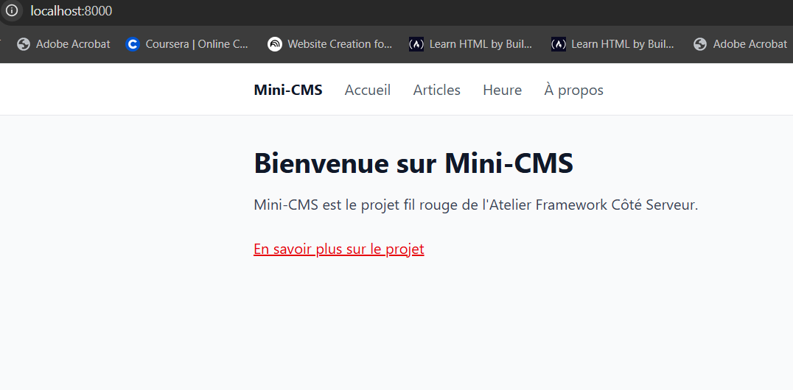

### Liste des articles

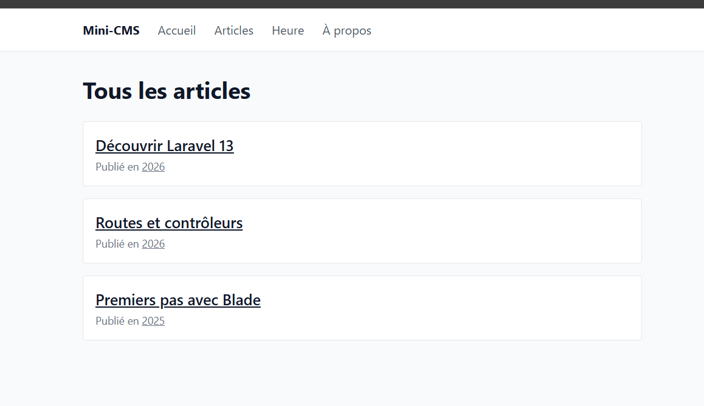

### Détail d'un article

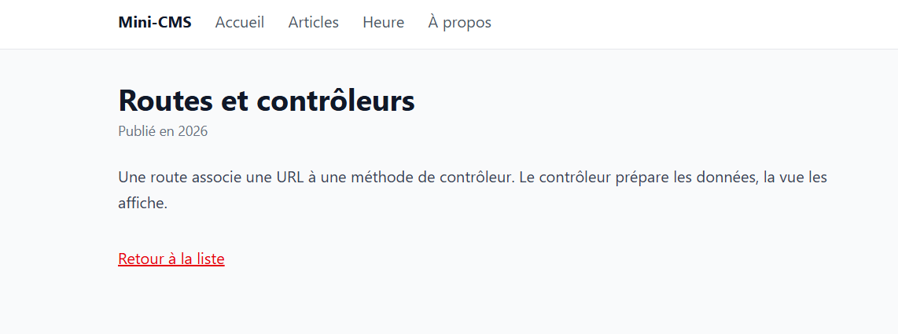

### Session 04

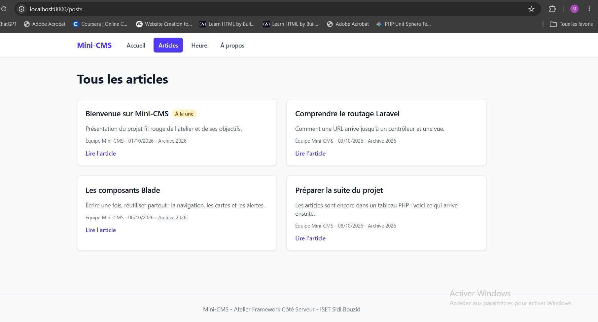

### Session 05

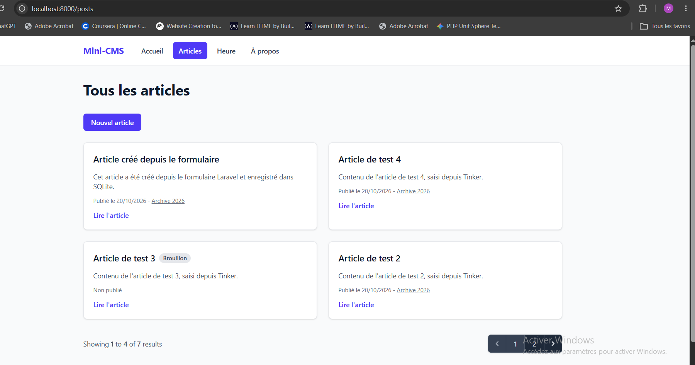

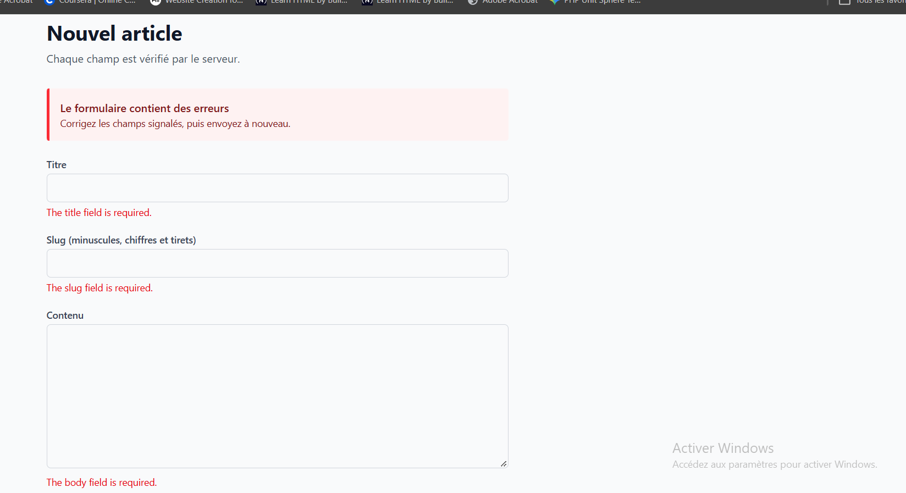
### Session 06

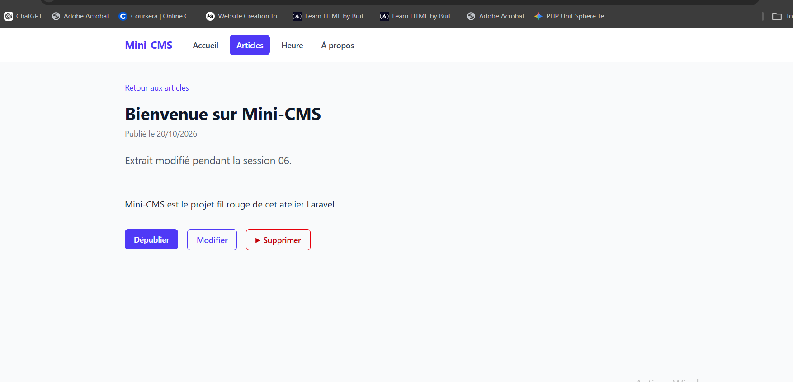

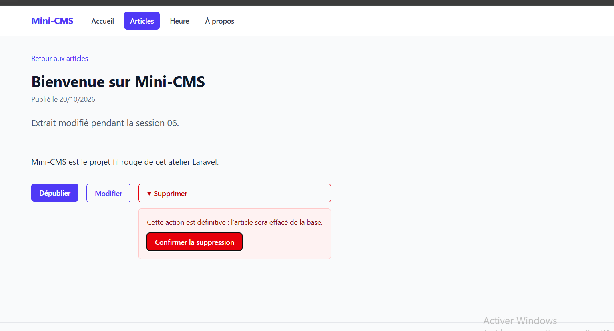

### Session 07

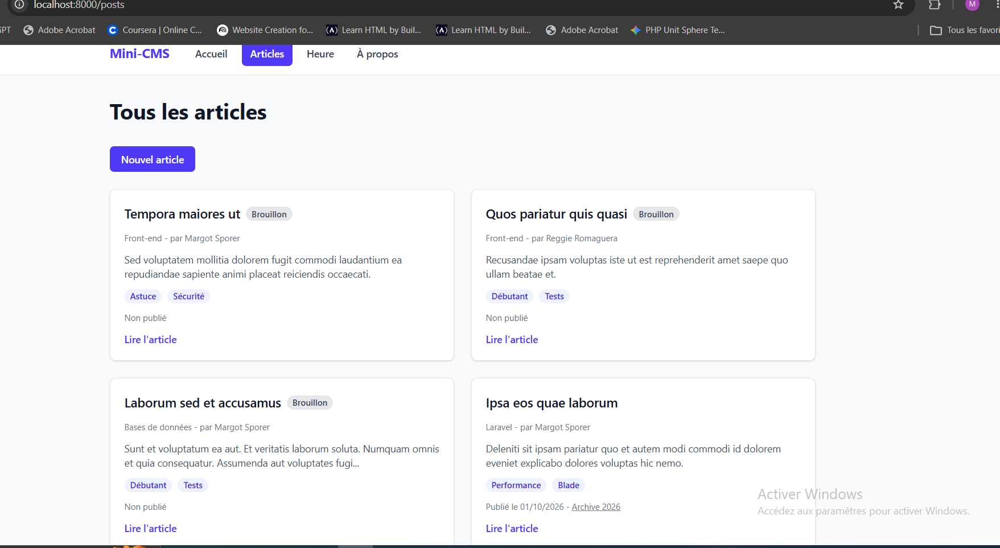

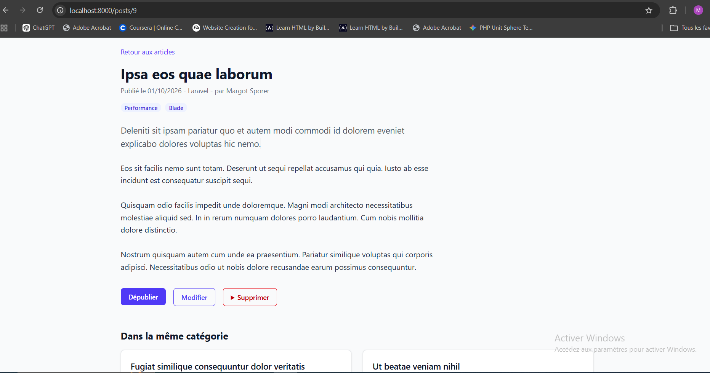

### Session 08

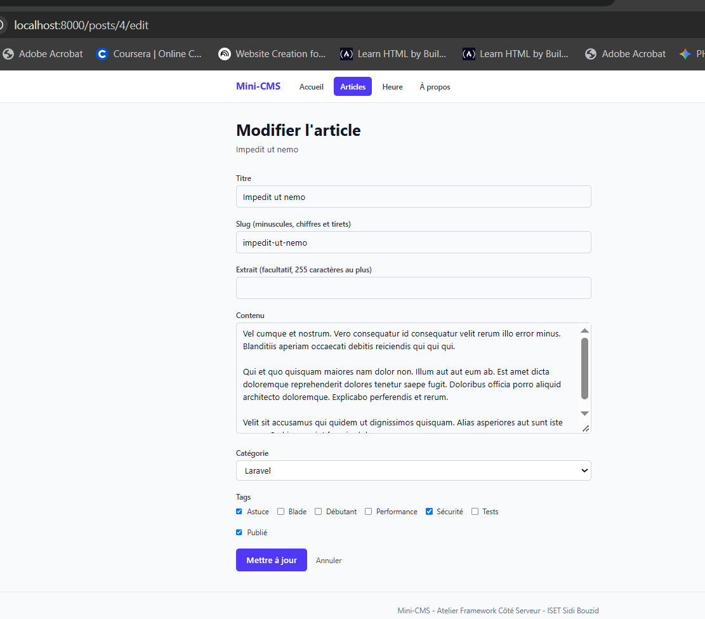

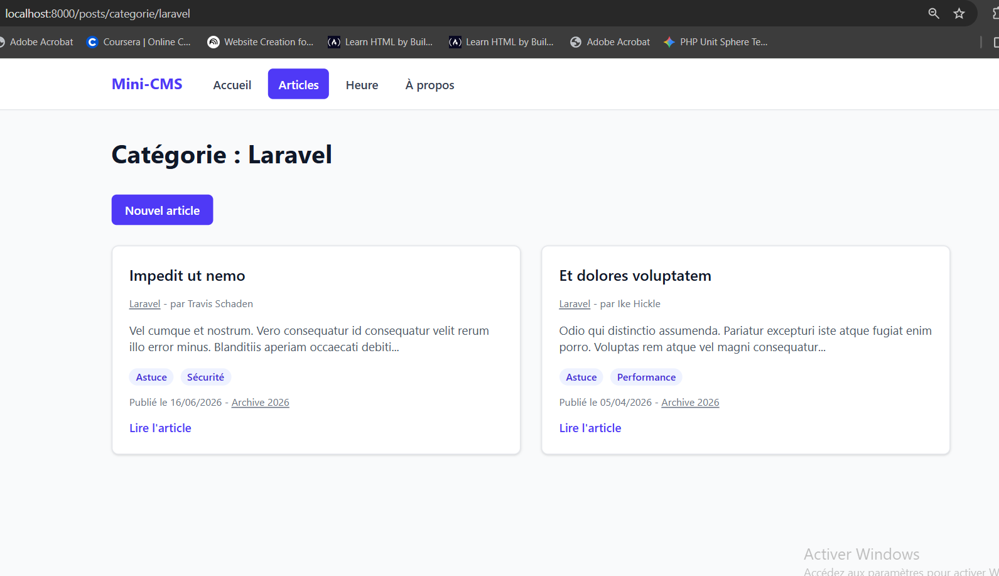

### Session 09

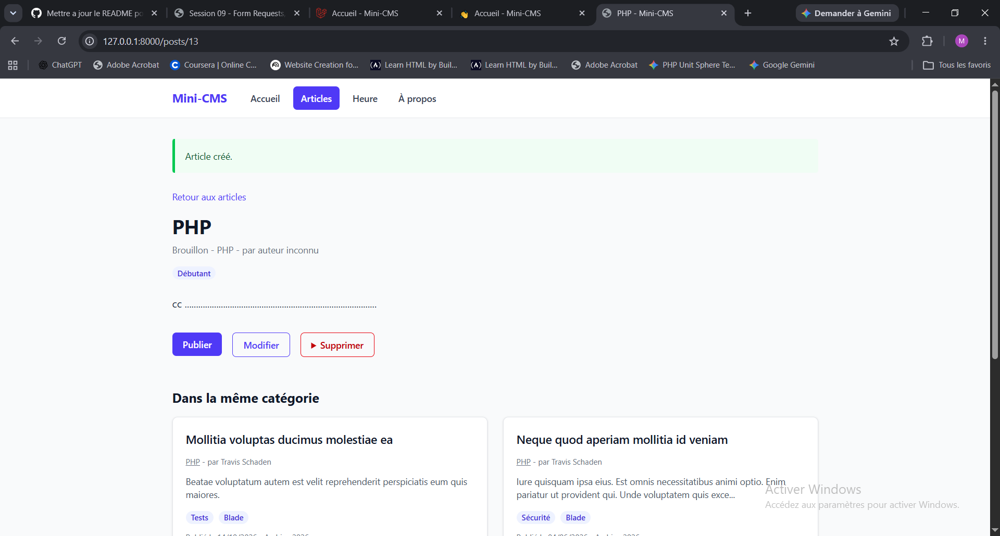

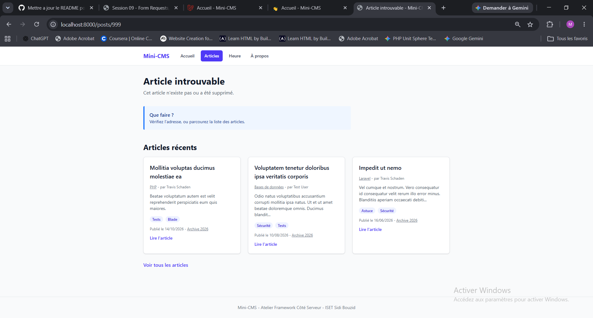